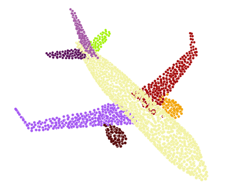

# CVPR 2019-PartNet
Code for PartNet: A Recursive Part Decomposition Network for Fine-grained and Hierarchical Shape Segmentation

### Intruduction

Deep learning approaches to 3D shape segmentation are
typically formulated as a multi-class labeling problem. Existing
models are trained for a fixed set of labels, which
greatly limits their flexibility and adaptivity. We opt for topdown
recursive decomposition and develop the first deep
learning model for hierarchical segmentation of 3D shapes,
based on recursive neural networks. Starting from a full
shape represented as a point cloud, our model performs
recursive binary decomposition, where the decomposition
network at all nodes in the hierarchy share weights. At each
node, a node classifier is trained to determine the type (adjacency
or symmetry) and stopping criteria of its decomposition.
The features extracted in higher level nodes are
recursively propagated to lower level ones. Thus, the meaningful
decompositions in higher levels provide strong contextual
cues constraining the segmentations in lower levels.
Meanwhile, to increase the segmentation accuracy at each
node, we enhance the recursive contextual feature with the
shape feature extracted for the corresponding part. Our
method segments a 3D shape in point cloud into an unfixed
number of parts, depending on the shape complexity, showing
strong generality and flexibility. It achieves the stateof-
the-art performance, both for fine-grained and semantic
segmentation, on the public benchmark and a new benchmark
of fine-grained segmentation proposed in this work.
We also demonstrate its application for fine-grained part
refinements in image-to-shape reconstruction.

### Dependencies

Requirements:
- Python 3.5 with numpy, scipy, torchfold, tensorboard and etc.
- [PyTorch](https://pytorch.org/resources)

Our code has been tested with Python 3.5, PyTorch 0.4.0, CUDA 8.0 on Ubuntu 16.04.
## News
***July 3, 2022.*** If you use Pytorch later than 1.6, please use this [new version](https://github.com/FENGGENYU/PartNet/tree/torch1.6-and-later).

***Dec 3, 2019.*** Our structure hierarchies are same as [GRASS](https://github.com/kevin-kaixu/grass_pytorch), but symmetric parameters have a little difference. Specifically, our symmetric parameter labels are:0--reflected,-1--rotational,1--translational, while GRASS uses 1--reflected,-1--rotational,0--translational. In addition, our translational parameters are set different from GRASS.
If you want to use symmetric parameters from [GRASS](https://github.com/kevin-kaixu/grass_pytorch), please use dataloader_grass.py.
If you want to use symmetric parameters from [PartNet_symh](https://github.com/FoggYu/PartNet_symh), please use dataloader_symh.py.

***Oct 30, 2019.*** Our extended datasets have been released at [here](https://github.com/FoggYu/PartNet_symh).

## Datasets and Pre-trained weights
The input pointcloud and training hierarchical trees are on [Here](https://www.dropbox.com/sh/7nuqb9wphsjkzko/AAAgy8zzmeRFsNuGuYCxUUWTa?dl=0).
Each category contains following folds:
- models_2048_points_normals: normalized input shape pointcloud with normal
- training_data_models_segment_2048_normals: GT part pointcloud with normal. (Note that we only store half parts of a shape, the other parts needs to be recovered by symmetric parameters.)
- training_trees: hierarchical structure(ops.mat) with symmetric parameters(syms.mat). The labels(labels.mat) are for testing.

Our dataset has been extended and updated these days:
#### Datasets information
|  category_name  |  chair   | airplane | table    |  sofa    | helicopter   | bike    |
| ---- | ---- | ---- | ---- | ---- | ---- | ---- |
| number of shapes | 999 | 630 | 583 | 630 | 100 | 155 |
| number of parts | 9697 | 5234 | 3207 | 4747 | 1415 | 1238 |
| maximum parts per shape | 25 | 14 | 17 | 27 | 21 | 9 |
| minimum parts per shape | 3 | 4 | 2 | 2 | 6 | 6 |

The Pre-trained model are on [Here](https://www.dropbox.com/sh/um1li37bnbkpuck/AAAaCAuXWaY050E7W5b42XT1a?dl=0).

### Usage: Demo
Require 3GB RAM on the GPU and 5sec to run.

This script takes as input a normalized 2048 pointcloud with normal (Sampled from ShapeNet model using [virtualscanner](https://github.com/Microsoft/O-CNN)). 

Please download Pre-trained weights of airplane first and put it at ./models/airplane.

Build extention for each op in ./pytorch_ops/*** (eg ./pytorch_ops/sampling/) using build.py

ps: torch 0.4 is required, and it won't work with later torch version.
```
python build.py
```
Then run
```
python test_demo.py
```


### Usage: Training

Put data of each category in ./data/category_name(eg ./data/airplane) 

Build extention for each op in ./pytorch_ops/*** (eg ./pytorch_ops/sampling/) using build.py

ps: torch 0.4 is required, and it won't work with later torch version.
```
python build.py
```
Then run training process
```
python train.py
```

More training and testing arguments are set in util.py
```
'--epochs' (number of epochs; default=1000)
'--batch_size' (batch size; default=10)
'--show_log_every' (show training log for every X frames; default=3)
'--no_cuda' (don't use cuda)
'--gpu' (device id of GPU to run cuda)
'--data_path' (dataset path, default='data')
'--save_path' (trained model path, default='models')
'--output_path' (segmented result path, default='results')
'--training' (training or testing, default=False)
'--split_num' (training data size for each category)
'--total_num' (full data size for each category, only for testing)
'--label_category' (semantic labels for each category, only for testing)
```
### Usage: Testing
To evaluate AP correctly, you need to set label_category for each category in util.py
```
'--label_category' (semantic labels for each category, only for testing)
```
We measure AP(%) with IoU threshold being 0.25 and 0.5, respectively. 
```
python ap_evaluate.py
```
Segmentation results and its corresponding GT can also be found in ./results/category_name(eg ./data/airplane).

#### AP information of our method on updated datasets and training/testing split.

|  category name   |  chair   | airplane | table    |  sofa    | helicopter   | bike    |
| ---- | ---- | ---- | ---- | ---- | ---- | ---- |
| IoU > 0.25 | 93.83 | 96.33 | 78.49 | 76.07 | 83.0 | 98.22 |
| IoU > 0.5 | 84.23 | 88.41 | 63.2 | 55.76 | 69.4 | 97.60 |

PS: If you want to try more new shapes, please make sure that them are oriented and normalized as our shapes.

## Citation
If you use this code, please cite the following paper.
```
@inproceedings{yu2019partnet,
    title = {PartNet: A Recursive Part Decomposition Network for Fine-grained and Hierarchical Shape Segmentation},
    author = {Fenggen Yu and Kun Liu and Yan Zhang and Chenyang Zhu and Kai Xu},
    booktitle = {CVPR},
    pages = {to appear},
    year = {2019}
}
```
